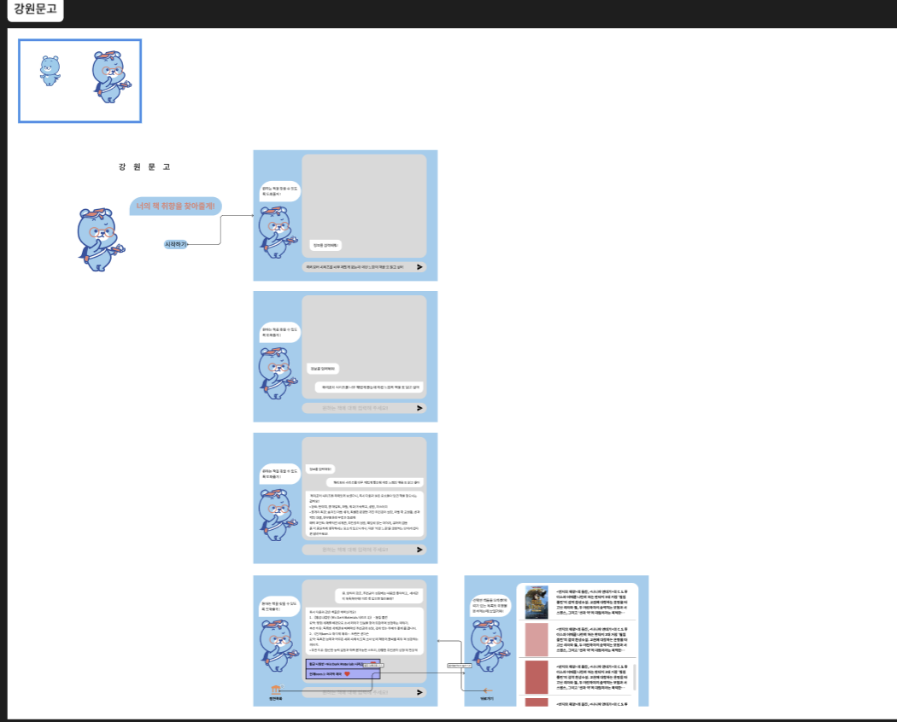

## Overview

This project is a personalized book recommendation system utilizing a RAG (Retrieval-Augmented Generation) based LLM (Large Language Model). It addresses the limitations of existing rating and purchase-history based systems and the lack of up-to-date information by providing users with clear recommendation rationales and a customized reading experience that reflects their preferences and interests.

## Tech Stack

- Frontend: FastAPI, Gemini (gemini-2.0-flash)
- Backend: React, TypeScript, Axios
- Database: ChromaDB (Vector DB)
